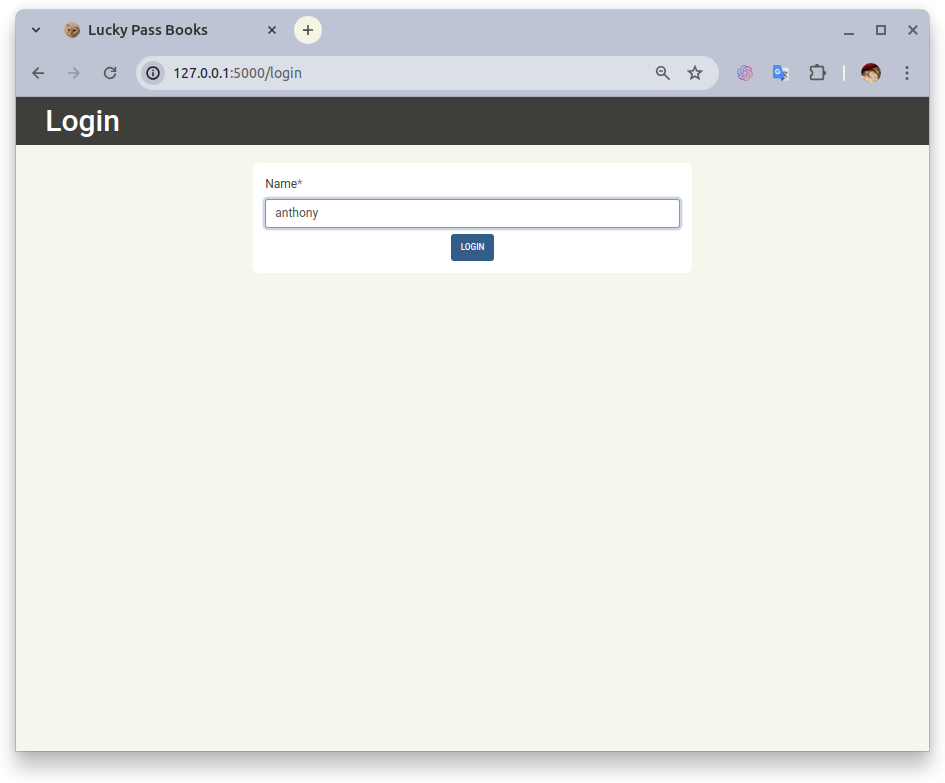
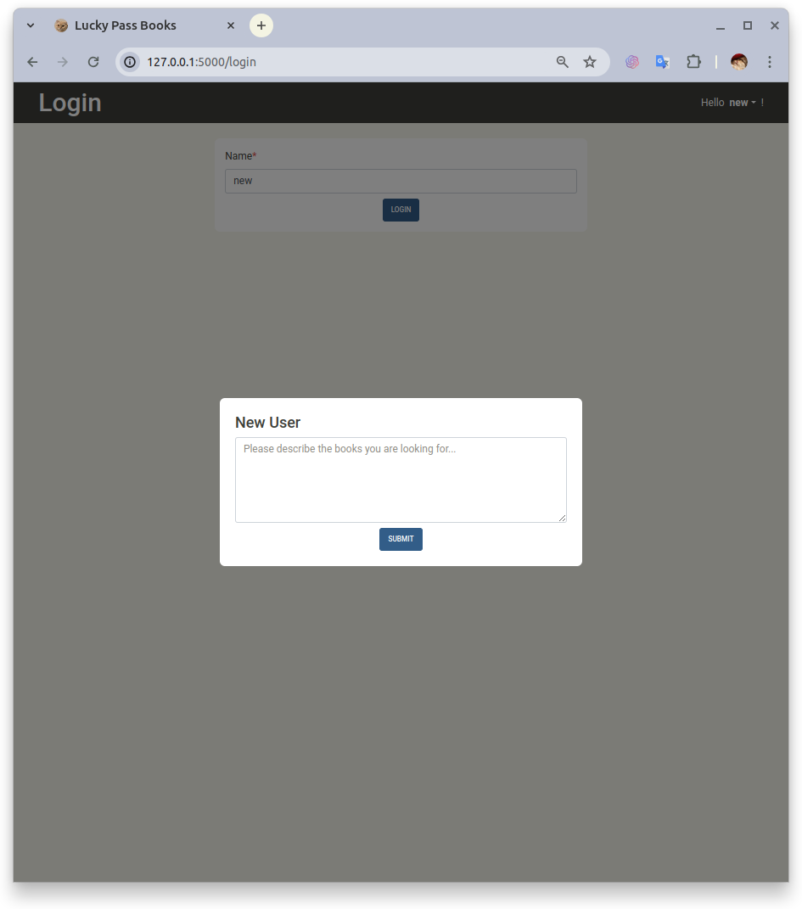
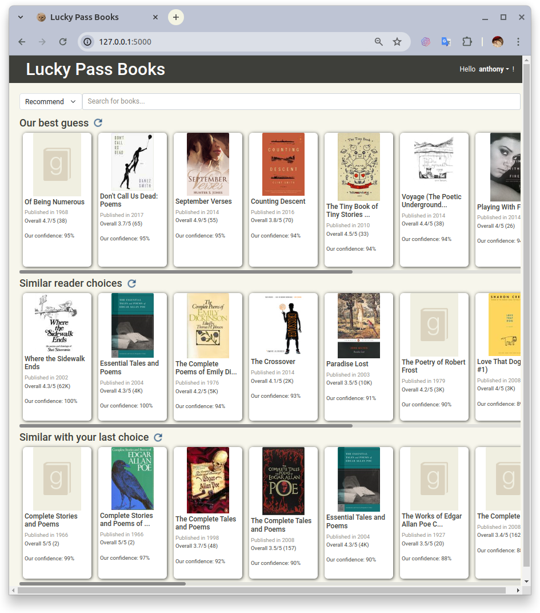
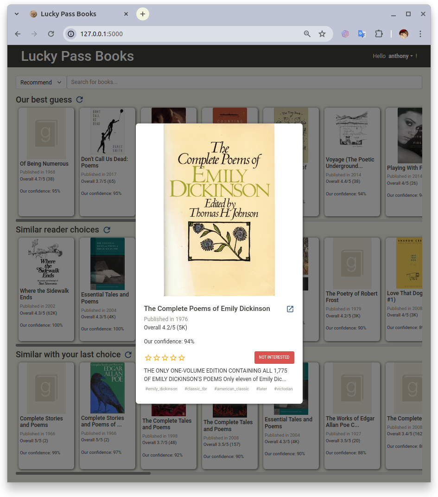
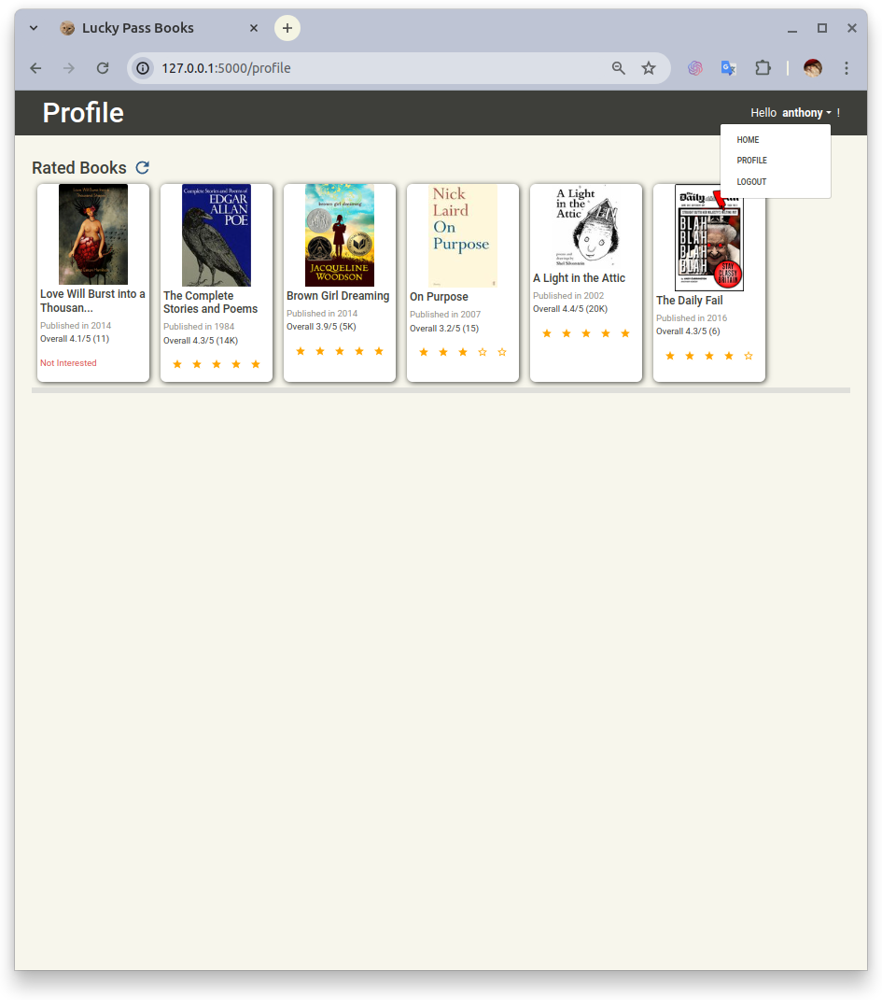

# Lucky Passbook

A book recommender system.


## Usage

You can run this demo project, by following the steps below.

### Install

First, you need to install [pypoetry](https://python-poetry.org/docs/) for dependencies management.
And run the following commands at the project's root dir for installation.

```
# if you don't need poetry to manage your venv
poetry config virtualenvs.create false

# install the project
poetry install
```

### Import Data
For testing, you can download the
[instance.zip](https://drive.google.com/file/d/1pGdfsKB98GEqCJV5aWuHBQlO2X27nThf/view?usp=drive_link)
then unzip and place the `instance` folder to the project's root dir.

### Run Server
Once you installed the project, you can run the command 
`flask --app recom_system.server run` for a dev server.

The server will compute and update the users profiles at every start.
It may be a 2 or 3 minutes wait.

### Access Webpage
After the server loaded, you can access http://localhost:5000 for the demo page.


You can login with our demo user `anthony` for fully recommendation,
or input another name for a new user.


If you a new user, the system will ask for your preference of books for the initial user profile.


We have 2 recommendation lists based on collaborative filtering:
* **Our best guess**, generated by a cascade hybrid algorithm.
The books will be filtered by SVD++ and ranked by SVD-NCF (NCF using SVD matrix as inputs).
This list will only show for users who rated at least 5 books
(You need to restart the server if you are a new user who just rated 5 books.
Because we haven't implemented a worker to update users profiles automatically).
* **Similar reader choices**, this KNN via Content algorithm is available for every user.


And 2 lists based on the books' content:
* **Similar with your last choice**, it just simply returns the similar books of the user's last positive rate (>3).
* **Based on your description**, only for new user who haven't rated any book, based on the initial profile.



If you are not interested in some books, you can click the "Not Interested" button
and refresh the recommendation list. It won't be shown anymore.


You can check the books you rated on the profile page.
