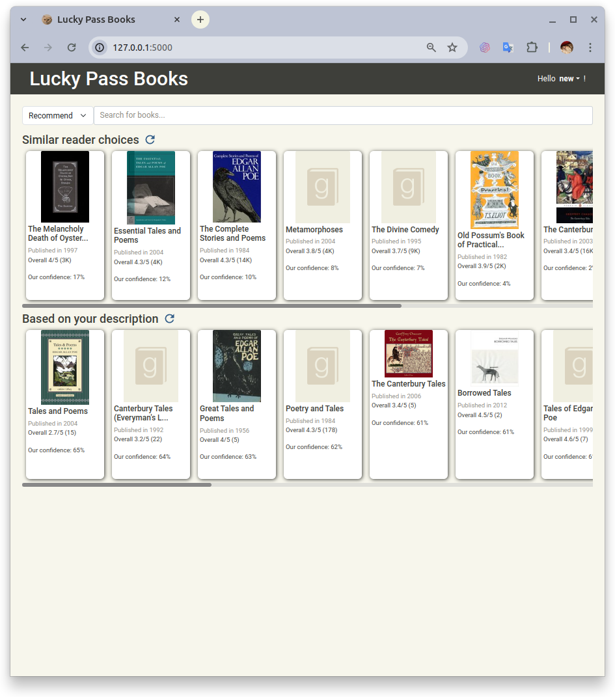

# Lucky Passbook

A book recommender system.


## Usage

You can run this demo project, by following the steps below.

### Install

First, you need to install [pypoetry](https://python-poetry.org/docs/) for dependencies management.
And run the following commands at the project's root dir for installation.

```
# if you don't need poetry to manage your venv
poetry config virtualenvs.create false

# install the project
poetry install
```

### Import Data
For testing, you can download the
[instance.zip](https://drive.google.com/file/d/1pGdfsKB98GEqCJV5aWuHBQlO2X27nThf/view?usp=drive_link)
then unzip and place the `instance` folder to the project's root dir.

### Run Server
Once you installed the project, you can run the command 
`flask --app recom_system.server run` for a dev server.

The server will compute and update the users profiles at every start.
It may be a 2 or 3 minutes wait.

### Access Webpage
After the server loaded, you can access http://localhost:5000 for the demo page.

#### Login

You can login with our demo user `anthony` for fully recommendation,
or input another name for a new user.


If you a new user, the system will ask for your preference of books for the initial user profile.

#### Hybrid Algorithms

We have 2 recommendation lists based on hybrid algorithms:
* **Our best guess**, generated by a cascade hybrid algorithm.
The books will be filtered by SVD++ and ranked by SVD-NCF (NCF using SVD matrix as inputs).
This list will only show for users who rated at least 5 books
(You need to restart the server if you are a new user who just rated 5 books.
Because we haven't implemented a worker to update users profiles automatically).
* **Similar reader choices**, this KNN via Content algorithm is available for every user.

#### Other Suggestions


* **Search with recommendation**, the result will be a combination of your profile and your keyword.
* **Similar with your last choice**, it just simply returns the similar books of the user's last positive rate (>3).
* **Based on your description**, only for new user who haven't rated any book, based on the initial profile.


#### Not Interested

If you are not interested in some books, you can click the "Not Interested" button
and refresh the recommendation list. It won't be shown anymore.

#### Profile Page

You can check the books you rated on the profile page.

## Notebooks

The following notebook contains the details of our experiment:

* **[Data Exploring](notebooks/Data%20Exploring.ipynb)**, showing the details of data and cleaning processes.
* **[Base Algorithms Testing](notebooks/Parallel%20Hybrid%20Model%20and%20Test%20Base%20Model.ipynb)**, includes RMSE test for User-Based & Item-Based KNN, SVD, and NCF. It also declared a weighted hybrid model.
* **[Algorithms Testing and Comparing](notebooks/Testing%20Algorithms.ipynb)**, shows the test results of baseline, SVD++, and hybrid models.
* **[NCF after SVD](notebooks/NCF%20after%20SVD.ipynb)**, is the training process of the hybrid model SVD-NCF.